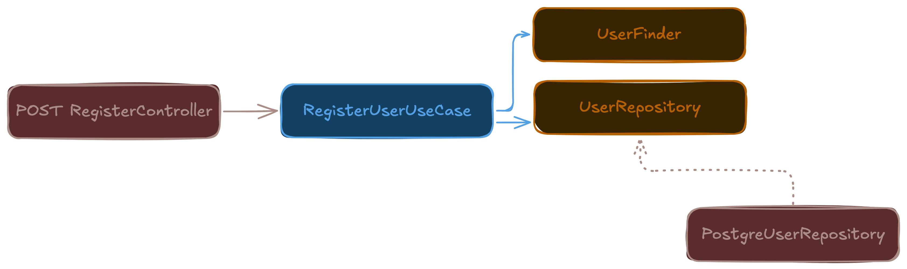

---
# You can also start simply with 'default'
theme: seriph
themeConfig:
  primary: '#F06C01'
# some information about your slides (markdown enabled)
title: Decoupling through events
info: |
  in this presentation we explore how adopting an event driven approach when choosing how your intenal domain will communicate, enables loose coupling plus is one of the best ways to achive the open/closed principle from solid# apply unocss classes to the current slide
class: text-center
# https://sli.dev/features/drawing
drawings:
  persist: false
# slide transition: https://sli.dev/guide/animations.html#slide-transitions
transition: slide-left
# enable MDC Syntax: https://sli.dev/features/mdc
mdc: true
# open graph
# seoMeta:
#  ogImage: https://cover.sli.dev

---

# Decoupling through events
a brief introduction to domain events and how it helps you follow some of the core SOLID principles

---

# 📮 Request flow

A visual representation of what a request flow looks like internally, this could really be coming from any source, like an http request, or a CLI command, or a message from a queue, etc.


---

# 📝 Real world request flow

Let's use a more concrete example for the sake of explanation



---
layout: two-cols
---

# 🧐 But what responsibilities are being concealed?

- Saves the new user to the database
- Sends a welcome email to the user

<div v-click>

- Present new user to staff over slack 

</div>

::right::

````md magic-move {lines: true}
```ts
export class RegisterUserUseCase {
  constructor(
    private userR: UserRepository,
    private mailer: EmailService,
  ) {}

  async execute(userData) {
    const user = await this.userR.save(userData)
    await this.mailer.sendWelcomeEmail(user)
  }
}
```

```ts
export class RegisterUserUseCase {
  constructor(
    private userR: UserRepository,
    private mailer: EmailService,
    private slack: SlackService,
  ) {}

  async execute(userData) {
    const user = await this.userR.save(userData)
    await this.mailer.sendWelcomeEmail(user)
    await this.slack.notifyStaff(user)
  }
}
```
````

---
layout: two-cols-header
---

# 🚌 Event bus
By implementing a mediator pattern, we can decouple the use case from the other responsibilities, and allow them to be handled by other parts of the system.

so now the use case looks like this:

::left::

<div class="pr-1">

```ts
export class RegisterUserUseCase {
  constructor(
    private userR: UserRepository,
    private eventBus: EventBus,
  ) {}

  async execute(userData) {
    const user = await this.userR.save(userData)
    this.eventBus.publish(new UserRegisteredEvent(user))
  }
}
```

</div>

::right::

<div class="pl-1">

```ts
export class Event {
  constructor(public readonly type: string, 
  public readonly UUID: string) {}
}

export class UserRegisteredEvent extends Event {
  constructor(public readonly user: User) {
    super('user.registered', UUID.generate())
  }
}
```
</div>

---
layout: two-cols-header
---

# 🧩 Event handlers

The event handlers are the ones that will handle the events published by the use case, and they can be implemented in any part of the system, as long as they are subscribed to the event bus.

::left::

<div class="pr-1">

```ts
export class UserMailWelcomerHandler 
    implements EventHandler<UserRegisteredEvent> {
  constructor(private mailer: EmailService) {}
  async handle(event: UserRegisteredEvent) {
    await this.mailer.sendWelcomeEmail(event.user)
  }
}
```

</div>

::right::

<div class="pl-1">

```ts
export class UserSlackNotifierHandler 
    implements EventHandler<UserRegisteredEvent> {
  constructor(private slack: SlackService) {}

  async handle(event: UserRegisteredEvent) {
    await this.slack.notifyStaff(event.user)
  }
}
```

</div>

---
layout: center
class: text-center
---

# Conclusion
Some of the SOLID principles, such as the single responsibility principle and the open/closed principle, really click when you start using domain events 📮. 

As you can see, the use case is now only responsible for saving the user and publishing the event, while the other responsibilities are handled by other parts of the system.

---
layout: center
class: text-center
---

# Thanks for your attention!

<PoweredBySlidev mt-10 />
